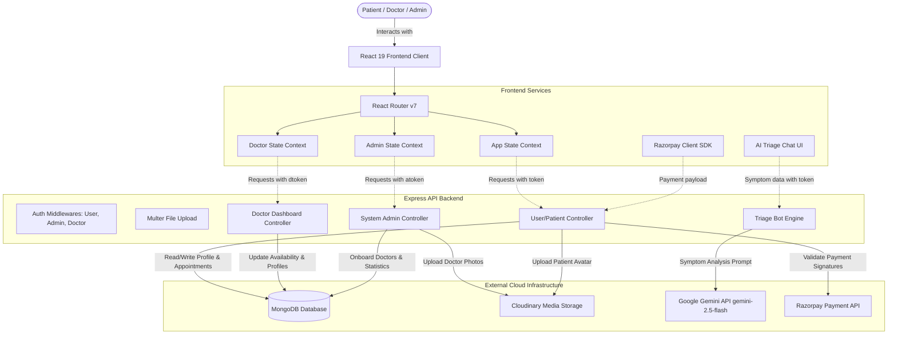

# 🏥 Mediversal - Comprehensive MERN Healthcare Management System

[](#)
[](#)
[](#)
[](#)

**Mediversal** is a premium, full-stack healthcare platform designed to bridge the gap between patients, doctors, and medical administrators. It integrates real-time doctor appointment booking, secure online payment processing via Razorpay, and a conversational **AI Symptom Triage Bot** powered by the Google Gemini API (`gemini-2.5-flash`).

> [!IMPORTANT]  
> The administrative panels for both **Admins** and **Doctors** are fully integrated into the patient-facing **Frontend Client**. There is no need to run a separate admin app. Simply navigate to the `/admin` route of the frontend to access the management portal.

🔗 **Live Deployment**: [Patient & Admin Client (Vercel)](https://mediversal-tf2h.vercel.app)  
*(To access the admin interface online, go to [https://mediversal-tf2h.vercel.app/admin](https://mediversal-tf2h.vercel.app/admin))*

---

## 🌟 Table of Contents
- [Key Features](#-key-features)
- [System Architecture](#-system-architecture)
- [Technology Stack](#%EF%B8%8F-technology-stack)
- [Navigation & Routes](#-navigation--routes)
- [AI Diagnostic Engine (Triage Bot)](#-ai-diagnostic-engine-triage-bot)
- [Database Models](#-database-models)
- [Security & Access Control](#-security--access-control)
- [Payment Integration Flow](#-payment-integration-flow)
- [API Reference](#-api-reference)
- [Installation & Setup](#-installation--setup)
- [Troubleshooting](#-troubleshooting)

---

## 🌟 Key Features

### 👤 For Patients (User Client)
*   **AI-Powered Triage Bot**: A highly interactive chat assistant utilizing Google Gemini to analyze patient symptoms, suggest severity levels, propose potential health conditions, and guide them to the appropriate specialty.
*   **Specialist Directory**: Browse certified doctors filtered by medical specialties (e.g., General Physician, Gynecologist, Dermatologist, Pediatrician, Neurologist, Gastroenterologist).
*   **Appointment Booking**: Select available time slots, manage upcoming appointments, and view booking history.
*   **Razorpay Integration**: Pay securely online to confirm appointments instantly.
*   **Profile Management**: Upload profile pictures, update medical metrics, and store contact info.

### 👨‍⚕️ For Doctors (Integrated Dashboard)
*   **Doctor Panel**: Access via `/admin` with individual credentials.
*   **Insights Dashboard**: Track total earnings, review daily appointments, and monitor patient count.
*   **Appointment Ledger**: Mark bookings as completed, cancel appointments, or track schedules.
*   **Profile Adjustments**: Modify fees, toggle availability states, and edit address details.

### 🛡️ For System Administrators (Integrated Dashboard)
*   **Admin Panel**: Access via `/admin` with central admin credentials.
*   **Doctor Directory**: Add new medical staff (includes profile photo upload to Cloudinary, specialty registration, bio, and education details).
*   **Global Monitoring**: Review all booked appointments system-wide.

---

## ⚙️ System Architecture

Mediversal is built as a single-repo, multi-package MERN stack application. The unified React client proxies API requests to the Express backend in development.



---

## 🛠️ Technology Stack

| Component | Technology | Description / Details |
| :--- | :--- | :--- |
| **Frontend** | React 19, Vite 7 | Modern, single-page client architecture with fast refresh |
| **Styling** | TailwindCSS 4 | Utility-first styling with premium custom components |
| **Backend** | Node.js, Express 5 | High-performance API server with Helmet and CORS security |
| **Database** | MongoDB, Mongoose 8 | NoSQL database modeling and object data relationship management |
| **AI Processing** | Google Gemini API | Natural language symptom diagnosis and classification using `gemini-2.5-flash` |
| **Image Storage** | Cloudinary | Secure cloud hosting for profile pictures |
| **Payment Gateways** | Razorpay | Production-ready payment flow handling and verification |
| **Security / Auth** | JWT, Bcrypt | Secure token-based user verification and password hashing |

---

## 📂 Project Structure

```plaintext
mediversal/
├── backend/                # Express API Application
│   ├── config/             # DB connection, Cloudinary config
│   ├── controllers/        # Route handlers (User, Doctor, Admin, Triage)
│   ├── middlewares/        # Authentication & Multer upload processing
│   ├── models/             # Mongoose schemas (User, Doctor, Appointment)
│   └── routes/             # REST API routes
│
└── frontend/               # Unified Client Application
    ├── src/
    │   ├── assets/         # App assets (icons, layout images)
    │   ├── components/     # UI elements (Navbar, Footer, Triagebot, AdminNavbar, AdminSidebar)
    │   ├── context/        # Shared Context state (AppContext, AdminContext, DoctorContext)
    │   ├── pages/          # Layout Pages (Home, About, Doctors List, Appointments, Login)
    │   │   ├── Admin/      # Integrated Admin panel pages (Add Doctor, All Appointments, Dashboard)
    │   │   └── Doctor/     # Integrated Doctor panel pages (Appointments, Profile, Dashboard)
    │   └── App.jsx         # Integrated route router configuration
    ├── vite.config.js      # Vite compilation configuration (includes backend proxy rule)
    └── .env                # Client environment variables
```

---

## 🧭 Navigation & Routes

The patient frontend and the administrator dashboards are unified into a single application.

| Route Path | Panel / Interface | Access Control |
| :--- | :--- | :--- |
| `/` | Patient Home | Public |
| `/doctors` | Specialty & Doctor Directory | Public |
| `/login` | Patient Login & Registration | Public |
| `/my-profile` | Patient Settings | Registered User |
| `/my-appointments` | Personal Appointments | Registered User |
| `/admin` | Admin Portal Entry point (Redirects) | Public |
| `/admin-login` | Dedicated Admin/Doctor login page | Public |
| `/admin-dashboard` | Central Administrator Overview | Authorized Admin (`atoken`) |
| `/add-doctor` | Onboard new doctors | Authorized Admin (`atoken`) |
| `/doctor-list` | Manage doctor listings | Authorized Admin (`atoken`) |
| `/all-appointments`| View all user bookings | Authorized Admin (`atoken`) |
| `/doctor-dashboard`| Doctor dashboard | Authorized Doctor (`dToken`) |
| `/doctor-appointments`| Manage assigned checkups | Authorized Doctor (`dToken`) |
| `/doctor-profile` | Update availability details | Authorized Doctor (`dToken`) |

---

## 🤖 AI Diagnostic Engine (Triage Bot)

The Mediversal **AI Symptom Triage Bot** leverages the `gemini-2.5-flash` model via the `@google/genai` SDK to evaluate user symptoms safely and dynamically.

### Prompt Rules & System Instructions
The triage assistant behaves under strict medical constraints defined in [triageController.js](file:///C:/Users/BIT/Desktop/mediversal/backend/controllers/triageController.js):
1. **Diagnosis Restrictions**: It will never provide a definitive diagnosis of specific diseases.
2. **Medication Restrictions**: It will never suggest specific medicines, dosages, or treatments.
3. **Specialty Mapping**: It maps symptoms exclusively to one of six supported specialties:
   * `Dermatologist`
   * `Gynecologist`
   * `Neurologist`
   * `Pediatrician` (always chosen for children under 12)
   * `Gastroenterologist`
   * `General physician` (default if unsure)
4. **Severity Level Evaluation**: Categorized as `Low` (treat at home), `Medium` (see doctor in 1-2 days), or `High` (urgent / ER warning).
5. **JSON Mode Output**: Outputs strict JSON for frontend processing:

```json
{
  "speciality": "Speciality Name",
  "reason": "Direct, empathetic conversational explanation addressing the patient.",
  "severity": "Low | Medium | High",
  "possibleConditions": ["Condition A", "Condition B"],
  "suggestedAction": "Clear actionable step for the patient",
  "emergencyWarning": "Specific warning for High severity symptoms, or empty string",
  "suggestedFollowups": ["Question 1", "Question 2", "Question 3"],
  "disclaimer": "Standard medical disclaimer."
}
```

---

## 📦 Database Models

Mediversal models are built on Mongoose schemas with indexes for high lookup performance:

### 1. Doctor Model (`doctorModel.js`)
*   `name`, `email`, `password`, `image` (Cloudinary URL).
*   `speciality` (Enum-matched), `degree`, `experience`, `about`.
*   `available` (Boolean), `fees` (Number), `address` (JSON), `slots_booked` (Object keeping track of reserved dates/times).

### 2. User Model (`userModel.js`)
*   `name`, `email`, `password`, `image`.
*   `address` (JSON), `gender`, `dob`, `phone`.

### 3. Appointment Model (`appointmentModel.js`)
*   `userId` (Ref to User), `docId` (Ref to Doctor).
*   `slotDate`, `slotTime` (e.g. `2026-07-10`, `10:00 AM`).
*   `userData` & `docData` (Snapshots of details for historical integrity).
*   `amount` (Fee), `date` (Timestamp of booking).
*   `cancelled` (Boolean), `payment` (Boolean), `isCompleted` (Boolean).

---

## 🔐 Security & Access Control

Mediversal implements role-based access control (RBAC) utilizing three distinct token headers:

1.  **User Access** (`token` Header): 
    *   Authorized for personal profile editing, booking appointments, listing/canceling own appointments, paying via Razorpay, and accessing AI triage.
2.  **Doctor Access** (`dtoken` Header):
    *   Authorized for retrieving assigned appointments, marking appointments as complete or cancelled, editing doctor profile, and changing slot availability.
3.  **Admin Access** (`atoken` Header):
    *   Authorized for adding new doctors, viewing global statistics, updating availability of any doctor, canceling any appointment, and viewing the global list of appointments.

### Security Configurations
*   **Helmet**: Protects HTTP headers; configured with `crossOriginResourcePolicy: false` to allow CORS asset streaming.
*   **CORS**: Dynamic origin mirroring to securely verify client hosts.
*   **Bcrypt**: Uses 10 salt rounds for secure password hashing.

---

## 💳 Payment Integration Flow

Razorpay integration handles secure, verified appointment booking transactions:

```plaintext
[Frontend Client]                              [Express Backend]                        [Razorpay Server]
        |                                              |                                        |
        |--- 1. Request Payment (appointment ID) ----->|                                        |
        |                                              |--- 2. Create Razorpay Order ---------->|
        |                                              |<-- 3. Return Razorpay Order Details --|
        |<-- 4. Send Order Details to Client ----------|                                        |
        |                                                                                       |
        |=== 5. Open Razorpay Checkout Modal (User pays) =======================================|
        |                                                                                       |
        |--- 6. Return payment_id, order_id, signature ----------------------------------------->|
        |                                                                                       |
        |--- 7. Call verifyRazorpay API -------------->|                                        |
        |       (payload: details & signature)         |--- 8. HmacSHA256 Sign Verification ----|
        |                                              |      (Matches Razorpay Secret Key)     |
        |                                              |--- 9. Mark appointment payment = true  |
        |<-- 10. Confirm success & update UI ----------|                                        |
```

---

## 📡 API Reference

### 👤 User/Patient Endpoints
*   `POST /api/user/register` - Create a new user profile.
*   `POST /api/user/login` - Authenticate user & get `token`.
*   `GET /api/user/get-profile` - Get authenticated user's details. (Requires `token`)
*   `POST /api/user/update-profile` - Update profile & upload avatar. (Requires `token`, accepts form-data)
*   `POST /api/user/book-appointment` - Book a slot. (Requires `token`, body: `{ docId, slotDate, slotTime }`)
*   `GET /api/user/appointments` - List user's appointments. (Requires `token`)
*   `POST /api/user/cancel-appointment` - Cancel an appointment. (Requires `token`, body: `{ appointmentId }`)
*   `POST /api/user/payment-razorpay` - Initiate Razorpay checkout order. (Requires `token`, body: `{ appointmentId }`)
*   `POST /api/user/verifyRazorpay` - Verify payment signature. (Requires `token`, body: `{ razorpay_payment_id, razorpay_order_id, razorpay_signature }`)

### 🤖 AI Triage Bot Endpoints
*   `POST /api/triage/analyze` - Send symptoms and previous conversation history for Gemini symptom analysis. (Requires `token`, body: `{ symptoms, history: [{ role, text }] }`)

### 🛡️ Admin Endpoints
*   `POST /api/admin/login` - Login with credentials (email, password) to get `atoken`.
*   `POST /api/admin/add-doctor` - Add new doctor, upload photo to Cloudinary. (Requires `atoken`, accepts form-data)
*   `GET /api/admin/all-doctors` - Retrieve list of all doctors with admin attributes. (Requires `atoken`)
*   `POST /api/admin/change-availability` - Toggle doctor's availability status. (Requires `atoken`, body: `{ docId }`)
*   `GET /api/admin/appointments` - Retrieve list of all system appointments. (Requires `atoken`)
*   `POST /api/admin/cancel-appointment` - System-wide cancellation. (Requires `atoken`, body: `{ appointmentId }`)
*   `GET /api/admin/dashboard` - Get overall statistics (number of doctors, appointments, users, recent bookings). (Requires `atoken`)

### 👨‍⚕️ Doctor Endpoints
*   `POST /api/doctor/login` - Authenticate doctor to get `dtoken`.
*   `GET /api/doctor/list` - Public list of doctors. (Public)
*   `GET /api/doctor/appointments` - Retrieve doctor's assigned appointments. (Requires `dtoken`)
*   `POST /api/doctor/appointments/complete` - Mark appointment as completed. (Requires `dtoken`, body: `{ appointmentId }`)
*   `POST /api/doctor/appointments/cancel` - Cancel appointment. (Requires `dtoken`, body: `{ appointmentId }`)
*   `GET /api/doctor/dashboard` - Doctor stats (earnings, appointments, unique patients, latest list). (Requires `dtoken`)
*   `GET /api/doctor/profile` - Retrieve detailed profile. (Requires `dtoken`)
*   `PUT /api/doctor/profile` - Update doctor profile (fees, address, availability, about). (Requires `dtoken`)
*   `POST /api/doctor/availability` - Toggle own availability status. (Requires `dtoken`)

---

## 🔧 Installation & Setup

### Prerequisites
*   **Node.js** (v18.0.0 or higher)
*   **npm** or **yarn**
*   **MongoDB Instance** (Local Community Server or MongoDB Atlas URL)

### 1. Environment Configurations

#### Backend Environment Setup
Create a `.env` file inside the `backend/` directory:
```env
PORT=4000
MONGODB_URL=your_mongodb_connection_uri
JWT_SECRET=your_jwt_signature_secret

# Default admin credentials
ADMIN_EMAIL=admin@mediversal.com
ADMIN_PASSWORD=admin123

# Cloudinary credentials (image uploads)
CLOUDINARY_CLOUD_NAME=your_cloudinary_cloud_name
CLOUDINARY_API_KEY=your_cloudinary_api_key
CLOUDINARY_API_SECRET=your_cloudinary_api_secret

# Razorpay credentials (checkout)
RAZORPAY_KEY_ID=your_razorpay_key_id
RAZORPAY_KEY_SECRET=your_razorpay_key_secret

# AI Diagnostic Engine (Gemini)
GEMINI_API_KEY=your_gemini_api_key
```

#### Frontend Environment Setup
Create a `.env` file inside the `frontend/` directory:
```env
VITE_RAZORPAY_KEY=your_razorpay_key_id
# VITE_BACKEND_URL can be left empty in development. The Vite Proxy redirects /api to the backend.
```

### 2. Run Locally

#### Run using the Setup Script (Windows Only)
A startup batch script is provided in the root directory to install dependencies and run both servers simultaneously:
```bash
.\run_local.bat
```

#### Manual Run (All OS)
Open two terminal windows in the project root:

**Terminal 1 (Backend Server):**
```bash
cd backend
npm install
npm run dev
```
*Backend server runs on `http://localhost:4000`.*

**Terminal 2 (Frontend Client):**
```bash
cd frontend
npm install
npm run dev
```
*Frontend client runs on `http://localhost:5173` (or `http://localhost:5174`).*

---

## 🛠️ Troubleshooting

### 1. CORS Errors / Blocked Requests
*   Ensure that backend/index.js CORS middleware is configured correctly.
*   In local development, the Vite server uses the proxy rule inside `vite.config.js` to bypass CORS. Ensure requests from the frontend use relative paths (e.g., `/api/...`) rather than fully qualified domain names if CORS issues persist.

### 2. Cloudinary Upload Failures
*   Check that your `CLOUDINARY_CLOUD_NAME`, `CLOUDINARY_API_KEY`, and `CLOUDINARY_API_SECRET` credentials in the backend `.env` are correct.
*   Ensure the uploaded image size does not exceed the limit configured in the multer setup (`backend/middlewares/multer.js`).

### 3. Triage Analysis Failures
*   Make sure `GEMINI_API_KEY` is defined in the backend `.env`.
*   Ensure that the server is online and connected to the internet. If you receive quota limit or model not found errors, check your Google AI Studio plan and API usage.

---
*Developed for the Mediversal Healthcare System.*
