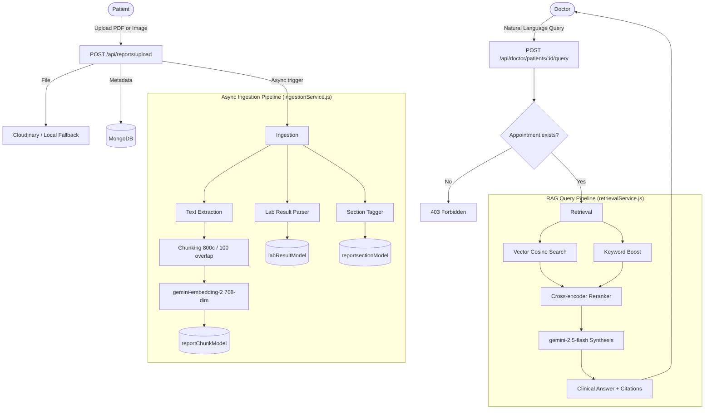
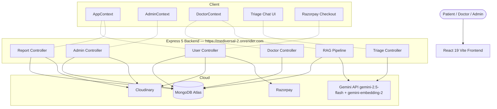

# 🏥 Mediversal — AI-Powered MERN Healthcare Platform

[](#)
[](#)
[](#)
[](#)
[](#)

**Mediversal** is a production-grade, full-stack healthcare management system connecting patients, doctors, and administrators under one unified platform. Beyond standard appointment booking and Razorpay payment processing, Mediversal features a **conversational AI Triage Bot** and — most recently — a complete **Medical Reports RAG (Retrieval-Augmented Generation) Engine**: patients upload their lab reports and scans, and doctors can query those documents using plain English to get clinically-synthesized answers powered by Gemini.

> [!IMPORTANT]
> The **Admin** and **Doctor** dashboards are fully merged into the patient-facing React app. No separate admin server needed. Just navigate to `/admin` on the frontend URL.

| | Link |
|:---|:---|
| **Frontend (Vercel)** | https://mediversal-tf2h.vercel.app |
| **Admin Portal** | https://mediversal-tf2h.vercel.app/admin |
| **Backend API (Render)** | https://mediversal-2.onrender.com |

---

## Table of Contents

1. [What's New — Medical Reports RAG Engine](#-whats-new--medical-reports-rag-engine)
2. [Full Feature Set](#-full-feature-set)
3. [System Architecture](#-system-architecture)
4. [Technology Stack](#️-technology-stack)
5. [Project Structure](#-project-structure)
6. [Navigation & Routes](#-navigation--routes)
7. [AI Triage Bot](#-ai-triage-bot)
8. [Database Models](#-database-models)
9. [Security & RBAC](#-security--rbac)
10. [Payment Flow](#-payment-flow)
11. [Full API Reference](#-full-api-reference)
12. [Installation & Setup](#-installation--setup)
13. [Troubleshooting](#-troubleshooting)

---

## 🆕 What's New — Medical Reports RAG Engine

> This is the flagship feature of the latest release. It transforms Mediversal from a scheduling tool into a **clinical intelligence platform**.

### The Problem It Solves

Doctors see dozens of patients daily. Reading through stacks of PDFs — blood tests, MRIs, pathology reports — is time-consuming and error-prone. Mediversal now lets a doctor ask in plain English:

> *"What were this patient's HbA1c levels in their last report?"*
> *"Does the patient have any abnormal liver enzyme values?"*
> *"Summarize all findings from their recent MRI scan."*

…and get a synthesized, citation-backed clinical answer in seconds.

---

### How It Works — End to End

#### Step 1 — Patient Uploads a Report

Patients upload PDF or image-format medical reports from their profile page. The file is stored on **Cloudinary** (with a local filesystem fallback if Cloudinary is unreachable).

```
POST /api/reports/upload   (token required)
```

The API responds immediately (`201 Created`) with the report record in `UPLOADED` state and launches the ingestion pipeline **asynchronously** — the patient's browser is never blocked.

---

#### Step 2 — Async Ingestion Pipeline

```
medicalReportModel.processingStatus:
  UPLOADED → PROCESSING → COMPLETED
                        ↘ FAILED (with errorMessage)
```

The pipeline (`backend/services/rag/ingestionService.js`) runs these stages:

| Stage | What happens |
|:---|:---|
| **Text Extraction** | Raw text pulled from PDF pages or OCR'd from images |
| **Semantic Chunking** | Text split into overlapping windows: **800 chars / 100 char overlap** |
| **Vector Embedding** | Every chunk encoded by `gemini-embedding-2` → **768-dimensional float vector** |
| **MongoDB Storage** | Chunks + vectors saved to `reportChunkModel` |
| **Lab Result Parsing** | Structured values (test name, value, unit, reference range, status) extracted and saved to `labResultModel` |
| **Section Tagging** | Document sections (Diagnosis, Summary, etc.) stored in `reportsectionModel` |

---

#### Step 3 — Doctor Queries the Records

Doctors access the **Clinical Workspace** for any patient they have (or had) an appointment with.

```
POST /api/doctor/patients/:patientId/query
{
  "query": "What were the patient's HbA1c levels?",
  "topK": 4
}
```

**Authorization Gate**: The backend verifies that at least one appointment exists between the requesting doctor and this patient. No appointment → `403 Forbidden`. No exceptions.

The query runs through `backend/services/rag/retrievalService.js`:

```
Query Text
    │
    ▼
gemini-embedding-2                ← embed the query itself
    │
    ├─► Vector Cosine Search      ← find semantically similar chunks
    │
    ├─► Keyword Filter Boost      ← surface exact term matches
    │
    └─► Merge + Cross-encoder Rerank
              │
              ▼
        Top-K Chunks + Structured Lab Values
              │
              ▼
        gemini-2.5-flash Synthesis
              │
              ▼
        Clinical Answer + Source Citations  ← returned to doctor UI
```

---

### RAG Architecture Diagram


```mermaid
graph TD
    Patient([Patient]) -->|Upload PDF or Image| Upload["POST /api/reports/upload"]
    Upload -->|File| Cloudinary[Cloudinary / Local Fallback]
    Upload -->|Metadata| MongoDB[(MongoDB)]
    Upload -->|Async trigger| Ingestion

    subgraph Ingestion Pipeline ["Async Ingestion Pipeline (ingestionService.js)"]
        Ingestion --> TextExt[Text Extraction]
        TextExt --> Chunk["Chunking 800c / 100 overlap"]
        Chunk --> Embed["gemini-embedding-2 768-dim"]
        Embed --> ChunkDB[(reportChunkModel)]
        Ingestion --> LabParse[Lab Result Parser]
        LabParse --> LabDB[(labResultModel)]
        Ingestion --> SectionParse[Section Tagger]
        SectionParse --> SectionDB[(reportsectionModel)]
    end

    Doctor([Doctor]) -->|Natural Language Query| Query["POST /api/doctor/patients/:id/query"]
    Query --> AuthGate{Appointment exists?}
    AuthGate -->|No| Forbidden[403 Forbidden]
    AuthGate -->|Yes| Retrieval

    subgraph RAG Query Pipeline ["RAG Query Pipeline (retrievalService.js)"]
        Retrieval --> VecSearch[Vector Cosine Search]
        Retrieval --> KwSearch[Keyword Boost]
        VecSearch & KwSearch --> Rerank[Cross-encoder Reranker]
        Rerank --> LLM["gemini-2.5-flash Synthesis"]
        LLM --> Answer[Clinical Answer + Citations]
    end
    Answer --> Doctor
```

---

### New Database Collections

| Collection | Purpose |
|:---|:---|
| `medicalreports` | Report metadata, Cloudinary URL, processing status, chunk count |
| `reportchunks` | Raw text chunks + 768-dim embedding vectors |
| `reportsections` | Tagged document sections (Diagnosis, Summary, etc.) |
| `labresults` | Structured: test name / value / unit / reference / status |

### New API Endpoints

| Method | Endpoint | Auth | Description |
|:---|:---|:---|:---|
| `POST` | `/api/reports/upload` | `token` | Upload report; async RAG ingestion starts immediately |
| `GET` | `/api/reports` | `token` | List all of the patient's uploaded reports |
| `DELETE` | `/api/reports/:reportId` | `token` | Delete report + Cloudinary file + all vector data |
| `GET` | `/api/doctor/patients/:patientId` | `dtoken` | Patient profile + appointment history |
| `GET` | `/api/doctor/patients/:patientId/reports` | `dtoken` | List patient's uploaded reports |
| `POST` | `/api/doctor/patients/:patientId/query` | `dtoken` | **RAG natural language query** — returns synthesized answer + citations |

---

## 🌟 Full Feature Set

### For Patients
- **AI Triage Bot** — symptom checker powered by `gemini-2.5-flash`; outputs specialty recommendation, severity, possible conditions, follow-up questions
- **Medical Report Upload** — PDF & image reports with async RAG indexing
- **Doctor Directory** — filterable by specialty (6 supported)
- **Appointment Booking** — slot selection, calendar view
- **Online Payment** — Razorpay checkout with HMAC signature verification
- **Profile Management** — avatar upload (Cloudinary), DOB, gender, phone, address

### For Doctors
- **Dashboard** — earnings, appointment count, unique patient count
- **Appointment Ledger** — complete / cancel individual appointments
- **Patient Clinical Workspace** *(new)* — patient details, uploaded reports, RAG query interface
- **Profile Editor** — fees, availability toggle, address, bio

### For Administrators
- **Doctor Management** — add new doctors with photo upload to Cloudinary
- **Global Appointment Viewer** — see and cancel all appointments system-wide
- **Dashboard Stats** — doctor count, appointment count, registered user count

---

## ⚙️ System Architecture


```mermaid
graph TD
    User([Patient / Doctor / Admin]) --> Frontend[React 19 Vite Frontend]

    subgraph Client
        AppCtx[AppContext]
        AdminCtx[AdminContext]
        DocCtx[DoctorContext]
        TriageUI[Triage Chat UI]
        RazorUI[Razorpay Checkout]
    end

    subgraph API ["Express 5 Backend — https://mediversal-2.onrender.com"]
        UserCtrl[User Controller]
        DocCtrl[Doctor Controller]
        AdminCtrl[Admin Controller]
        TriageCtrl[Triage Controller]
        ReportCtrl[Report Controller]
        RAG[RAG Pipeline]
    end

    subgraph Cloud
        Mongo[(MongoDB Atlas)]
        CDN[Cloudinary]
        GeminiAPI["Gemini API gemini-2.5-flash + gemini-embedding-2"]
        RPay[Razorpay]
    end

    AppCtx -.- UserCtrl
    AppCtx -.- ReportCtrl
    DocCtx -.- DocCtrl
    DocCtx -.- RAG
    AdminCtx -.- AdminCtrl
    TriageUI -.- TriageCtrl
    RazorUI -.- UserCtrl

    UserCtrl --> Mongo
    DocCtrl --> Mongo
    AdminCtrl --> Mongo
    ReportCtrl --> Mongo
    RAG --> Mongo

    AdminCtrl --> CDN
    UserCtrl --> CDN
    ReportCtrl --> CDN

    TriageCtrl --> GeminiAPI
    RAG --> GeminiAPI
    UserCtrl --> RPay
```

---

## 🛠️ Technology Stack

| Layer | Technology | Notes |
|:---|:---|:---|
| Frontend | React 19, Vite 7, React Router v7 | SPA, fast refresh, proxy-based dev API |
| Styling | TailwindCSS 4 | Utility-first, custom component layer |
| Backend | Node.js 20, Express 5 | ESM modules, async/await throughout |
| Database | MongoDB Atlas, Mongoose 8 | Stores documents, embeddings, lab data |
| AI Triage | `gemini-2.5-flash` via `@google/genai` | JSON-mode structured output |
| RAG Embeddings | `gemini-embedding-2` | 768-dim dense vectors, cosine similarity |
| RAG Retrieval | Custom hybrid + reranker | Vector + keyword fusion, cross-encoder rerank |
| RAG LLM Synthesis | `gemini-2.5-flash` | Contextual clinical answer generation |
| File Storage | Cloudinary + local fallback | Auto-fallback when Cloudinary is unreachable |
| Payments | Razorpay | HMAC-SHA256 signature verification |
| Auth | JWT + Bcrypt (10 rounds) | Three token tiers: user / doctor / admin |
| Security | Helmet, CORS, express-rate-limit | 300 req/15min; 30 req/15min for triage |

---

## 📂 Project Structure

```
mediversal/
├── backend/
│   ├── config/
│   │   ├── mongodb.js
│   │   └── cloudinary.js          # uploadToStorage + local fallback
│   ├── controllers/
│   │   ├── userController.js
│   │   ├── doctor-controller.js
│   │   ├── admincontroller.js
│   │   ├── triageController.js
│   │   ├── reportController.js    # NEW — upload / list / delete reports
│   │   └── doctorReportController.js  # NEW — clinical workspace + RAG query
│   ├── middlewares/
│   │   ├── authUser.js
│   │   ├── authDoctor.js
│   │   ├── authAdmin.js
│   │   └── multer.js
│   ├── models/
│   │   ├── userModel.js
│   │   ├── doctorModel.js
│   │   ├── appointmentModel.js
│   │   ├── medicalReportModel.js  # NEW
│   │   ├── reportChunkModel.js    # NEW — 768-dim vectors
│   │   ├── reportsectionModel.js  # NEW
│   │   └── labResultModel.js      # NEW
│   ├── routes/
│   │   ├── userRoute.js
│   │   ├── doctorRoute.js
│   │   ├── adminRoute.js
│   │   ├── triageRoute.js
│   │   ├── reportRoute.js         # NEW
│   │   └── doctorReportRoute.js   # NEW
│   └── services/
│       └── rag/                   # NEW — full RAG pipeline
│           ├── config.js          # env-driven model & chunking params
│           ├── ingestionService.js
│           ├── embeddingService.js
│           ├── queryService.js
│           ├── retrievalService.js
│           ├── llmService.js
│           └── ragUtils.js
│
├── frontend/                      # Unified patient + admin + doctor app
│   ├── src/
│   │   ├── context/               # AppContext, AdminContext, DoctorContext
│   │   ├── pages/
│   │   │   ├── Admin/
│   │   │   └── Doctor/
│   │   └── App.jsx
│   ├── vite.config.js             # /api proxy → localhost:4000 (dev)
│   └── .env
│
└── admin/                         # (legacy — merged into frontend)
```

---

## 🧭 Navigation & Routes

| Route | Interface | Access |
|:---|:---|:---|
| `/` | Patient Home | Public |
| `/doctors` | Doctor Directory | Public |
| `/login` | Patient Login / Register | Public |
| `/my-profile` | Profile & Medical Reports | Authenticated User |
| `/my-appointments` | Appointment History | Authenticated User |
| `/admin` | Admin/Doctor Portal entry | Public (redirects) |
| `/admin-login` | Admin / Doctor Login | Public |
| `/admin-dashboard` | Admin Overview | Admin token |
| `/add-doctor` | Onboard Doctor | Admin token |
| `/doctor-list` | Doctor Directory (admin) | Admin token |
| `/all-appointments` | All Bookings | Admin token |
| `/doctor-dashboard` | Doctor Overview | Doctor token |
| `/doctor-appointments` | Doctor Appointment Ledger | Doctor token |
| `/doctor-profile` | Doctor Profile Editor | Doctor token |

---

## 🤖 AI Triage Bot

Endpoint: `POST /api/triage/analyze` (requires `token`)

Body:
```json
{
  "symptoms": "I have had a headache for 3 days and blurred vision",
  "history": [{ "role": "user", "text": "..." }, { "role": "model", "text": "..." }]
}
```

### Constraints (enforced via system prompt)
- ❌ Never gives a definitive disease diagnosis
- ❌ Never recommends specific medicines or dosages
- ✅ Maps to one of 6 specialties: `General physician`, `Dermatologist`, `Gynecologist`, `Neurologist`, `Pediatrician`, `Gastroenterologist`
- ✅ Always uses Pediatrician for patients under 12
- ✅ Severity: `Low` / `Medium` / `High`

### JSON Response Schema
```json
{
  "speciality": "Neurologist",
  "reason": "Your symptoms suggest...",
  "severity": "Medium",
  "possibleConditions": ["Migraine", "Hypertension"],
  "suggestedAction": "Schedule an appointment within 24 hours",
  "emergencyWarning": "",
  "suggestedFollowups": ["Do you have nausea?", "Any vision changes?"],
  "disclaimer": "This is not a medical diagnosis..."
}
```

---

## 📦 Database Models

### Core Models

**Doctor** — `name`, `email`, `password`, `image`, `speciality`, `degree`, `experience`, `about`, `available`, `fees`, `address`, `slots_booked`

**User** — `name`, `email`, `password`, `image`, `address`, `gender`, `dob`, `phone`

**Appointment** — `userId`, `docId`, `slotDate`, `slotTime`, `userData`, `docData` (snapshots), `amount`, `date`, `cancelled`, `payment`, `isCompleted`

### RAG Models (NEW)

**medicalReportModel**
```
patientId        → User ref
fileName         → string
fileUrl          → Cloudinary / local URL
fileType         → MIME type
reportType       → "Blood Test" | "MRI" | "X-Ray" | "Other"
processingStatus → "UPLOADED" | "PROCESSING" | "COMPLETED" | "FAILED"
chunkCount       → number of vectors stored
errorMessage     → failure detail (if any)
metadata         → { cloudinaryPublicId, sizeBytes, storageMode }
```

**reportChunkModel**
```
reportId       → MedicalReport ref
patientId      → User ref
text           → raw chunk text (≤800 chars)
embedding      → [768 floats] — gemini-embedding-2
chunkIndex     → position within document
embeddingModel → "gemini-embedding-2"
embeddingTag   → "gemini-embedding-2:768"
```

**labResultModel**
```
reportId        → MedicalReport ref
patientId       → User ref
testName        → "HbA1c"
value           → "6.8"
unit            → "%"
referenceRange  → "4.0–5.6"
status          → "Normal" | "Abnormal" | "Critical"
category        → "Haematology" | "Biochemistry" | etc.
```

---

## 🔐 Security & RBAC

Three independent JWT token tiers, each passed in request headers:

| Token Header | Role | Permissions |
|:---|:---|:---|
| `token` | Patient | Profile, appointments, payments, triage, report upload/delete |
| `dtoken` | Doctor | Own appointments, own profile, **clinical workspace** (appointment-gated) |
| `atoken` | Admin | All doctors, all appointments, global stats |

**Clinical Workspace Access Rule**: A doctor can only access a patient's workspace if `appointmentModel.findOne({ docId, userId: patientId })` returns a document. Any query, report list, or patient detail request without this relationship returns `403 Forbidden`.

**Other security layers:**
- **Helmet** — hardens HTTP headers (`crossOriginResourcePolicy: false` for media streaming)
- **CORS** — allowlist via `ALLOWED_ORIGINS` env (open in dev, restricted in prod)
- **Rate Limiting** — 300 req / 15 min (API-wide); 30 req / 15 min (triage)
- **Bcrypt** — 10 salt rounds

---

## 💳 Payment Flow

```
Patient                 Backend                 Razorpay
   │                      │                        │
   │── book-appointment ──►│                        │
   │◄─ appointmentId ──────│                        │
   │                      │                        │
   │── payment-razorpay ──►│                        │
   │                      │── createOrder ─────────►│
   │                      │◄─ order details ────────│
   │◄─ order details ──────│                        │
   │                      │                        │
   │══ Razorpay Modal (user pays) ══════════════════│
   │                      │                        │
   │── verifyRazorpay ────►│                        │
   │   (payment_id,        │── HMAC-SHA256 verify ──│
   │    order_id,          │                        │
   │    signature)         │── mark payment=true    │
   │◄─ success ────────────│                        │
```

---

## 📡 Full API Reference

### Patient Endpoints

| Method | Path | Auth | Description |
|:---|:---|:---|:---|
| POST | `/api/user/register` | — | Register new patient |
| POST | `/api/user/login` | — | Login, returns JWT |
| GET | `/api/user/get-profile` | token | Get own profile |
| POST | `/api/user/update-profile` | token | Update profile + avatar |
| POST | `/api/user/book-appointment` | token | Book a slot |
| GET | `/api/user/appointments` | token | List own appointments |
| POST | `/api/user/cancel-appointment` | token | Cancel an appointment |
| POST | `/api/user/payment-razorpay` | token | Initiate Razorpay order |
| POST | `/api/user/verifyRazorpay` | token | Verify payment + confirm |

### Medical Reports (Patient)

| Method | Path | Auth | Description |
|:---|:---|:---|:---|
| POST | `/api/reports/upload` | token | Upload PDF/image; async RAG ingestion |
| GET | `/api/reports` | token | List own reports |
| DELETE | `/api/reports/:reportId` | token | Delete report + vectors |

### AI Triage

| Method | Path | Auth | Description |
|:---|:---|:---|:---|
| POST | `/api/triage/analyze` | token | Symptom analysis via Gemini |

### Admin Endpoints

| Method | Path | Auth | Description |
|:---|:---|:---|:---|
| POST | `/api/admin/login` | — | Get admin token |
| POST | `/api/admin/add-doctor` | atoken | Add doctor + photo |
| GET | `/api/admin/all-doctors` | atoken | List all doctors |
| POST | `/api/admin/change-availability` | atoken | Toggle availability |
| GET | `/api/admin/appointments` | atoken | All appointments |
| POST | `/api/admin/cancel-appointment` | atoken | Cancel any appointment |
| GET | `/api/admin/dashboard` | atoken | Global statistics |

### Doctor Endpoints

| Method | Path | Auth | Description |
|:---|:---|:---|:---|
| POST | `/api/doctor/login` | — | Get doctor token |
| GET | `/api/doctor/list` | — | Public doctor list |
| GET | `/api/doctor/appointments` | dtoken | Own appointments |
| POST | `/api/doctor/appointments/complete` | dtoken | Mark complete |
| POST | `/api/doctor/appointments/cancel` | dtoken | Cancel appointment |
| GET | `/api/doctor/dashboard` | dtoken | Earnings + stats |
| GET | `/api/doctor/profile` | dtoken | Own profile |
| PUT | `/api/doctor/profile` | dtoken | Update profile |
| POST | `/api/doctor/availability` | dtoken | Toggle availability |

### Doctor Clinical Workspace (RAG)

| Method | Path | Auth | Description |
|:---|:---|:---|:---|
| GET | `/api/doctor/patients/:patientId` | dtoken | Patient profile + history |
| GET | `/api/doctor/patients/:patientId/reports` | dtoken | Patient's reports list |
| POST | `/api/doctor/patients/:patientId/query` | dtoken | **RAG query** — natural language → clinical answer |

---

## 🔧 Installation & Setup

### Prerequisites
- Node.js ≥ 18
- npm or yarn
- MongoDB Atlas connection string

### Backend `.env`
```env
PORT=4000
MONGODB_URL=mongodb+srv://...
JWT_SECRET=your_secret

ADMIN_EMAIL=admin@mediversal.com
ADMIN_PASSWORD=yourpassword

CLOUDINARY_CLOUD_NAME=...
CLOUDINARY_API_KEY=...
CLOUDINARY_API_SECRET=...

RAZORPAY_KEY_ID=...
RAZORPAY_KEY_SECRET=...

# Gemini — triage + RAG embeddings + synthesis
GEMINI_API_KEY=...
GEMINI_MODEL=gemini-2.5-flash
GEMINI_EMBEDDING_MODEL=gemini-embedding-2
EMBEDDING_DIM=768

# Production CORS (comma-separated)
# ALLOWED_ORIGINS=https://mediversal-tf2h.vercel.app
```

### Frontend `.env`
```env
VITE_RAZORPAY_KEY=...
# Production:
VITE_BACKEND_URL=https://mediversal-2.onrender.com
# Local dev: leave VITE_BACKEND_URL empty — Vite proxy handles /api → localhost:4000
```

### Admin `.env`
```env
# Production:
VITE_BACKEND_URL=https://mediversal-2.onrender.com
# Local dev:
# VITE_BACKEND_URL=http://localhost:4000
```

### Run Locally

**Windows (one command):**
```bash
.\run_local.bat
```

**Manual:**
```bash
# Terminal 1
cd backend && npm install && npm run dev
# → http://localhost:4000

# Terminal 2
cd frontend && npm install && npm run dev
# → http://localhost:5174
```

> [!TIP]
> For local dev, comment out `VITE_BACKEND_URL` in `frontend/.env` — the Vite proxy rewrites `/api/*` to `localhost:4000` automatically.

---

## 🛠️ Troubleshooting

| Problem | Fix |
|:---|:---|
| CORS errors in production | Set `ALLOWED_ORIGINS=https://your-vercel-domain.app` in backend `.env` |
| Cloudinary uploads failing | Verify cloud name, API key, API secret. Reports fallback to `backend/public/uploads/` automatically |
| Triage returns errors | Check `GEMINI_API_KEY` is valid and quota not exceeded on AI Studio |
| Report stuck in `PROCESSING` | Async ingestion failed — check server logs. Ensure `GEMINI_API_KEY` can access `gemini-embedding-2` |
| Doctor RAG returns 403 | Doctor must have ≥1 appointment with the patient (any status) |
| Re-indexing after `EMBEDDING_DIM` change | Run `node backend/services/reembedchunks.js` to recompute all vectors |

---

*Mediversal — Built for the future of clinical care.*
