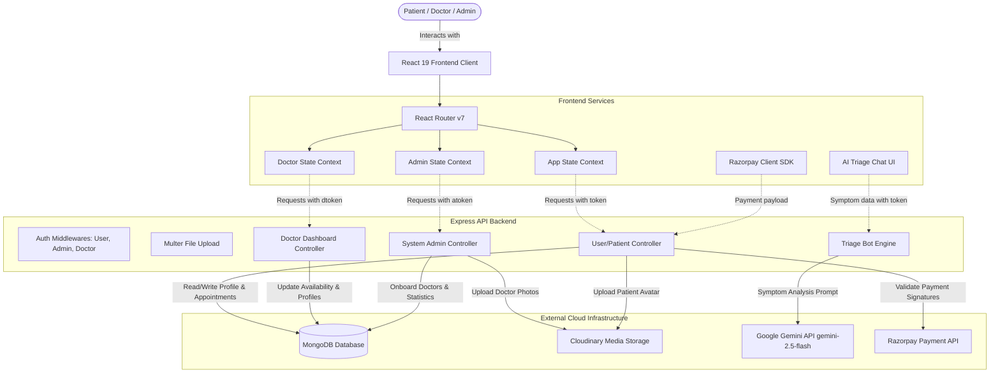

# 🏥 Mediversal – End-to-End Master Context & SDE Interview Playbook

> **How to use this document:** You can feed this entire document into any LLM (ChatGPT, Claude, Gemini) with the prompt:  
> review it before an interview to master every architectural decision, metric calculation, code path, and tradeoff.

---

## 📑 Table of Contents
1. [Executive Project Summary & Tech Stack](#1-executive-project-summary--tech-stack)
2. [Resume Metrics & Calculation Methodology (Fresher/Student Grounding)](#2-resume-metrics--calculation-methodology-fresherstudent-grounding)
3. [System Architecture & Core Modules](#3-system-architecture--core-modules)
   - [Module 1: Tri-Panel Role-Based Access Control (RBAC)](#module-1-tri-panel-role-based-access-control-rbac)
   - [Module 2: Real-Time Conflict-Free Appointment Booking Engine](#module-2-real-time-conflict-free-appointment-booking-engine)
   - [Module 3: Razorpay Payment Gateway & Cryptographic Signature Verification](#module-3-razorpay-payment-gateway--cryptographic-signature-verification)
   - [Module 4: Gemini 2.5 Flash AI Symptom Triage Bot](#module-4-gemini-25-flash-ai-symptom-triage-bot)
4. [End-to-End Execution Lifecycles](#4-end-to-end-execution-lifecycles)
5. [System Design Trade-offs & Deep Engineering Discussions](#5-system-design-trade-offs--deep-engineering-discussions)
6. [Codebase Architecture & File Mapping](#6-codebase-architecture--file-mapping)
7. [Comprehensive SDE & AI Interview Q&A](#7-comprehensive-sde--ai-interview-qa)

---

## 1. Executive Project Summary & Tech Stack

### 🎯 High-Level Pitch
**Mediversal** is a full-stack, AI-augmented healthcare management platform built using the MERN stack (`React 19`, `Node.js`, `Express 5`, `MongoDB Atlas`). It addresses healthcare bottlenecks:
1. **Administrative & Booking Inefficiencies**: Streamlines doctor discovery, real-time conflict-free slot booking, and Razorpay digital payments across three role-segregated panels (**Patient**, **Doctor**, **Admin**).
2. **Clinical & Pre-Consultation Latency**: Reduces patient intake friction via a **Gemini 2.5 Flash-powered AI Symptom Triage Bot** (3-tier severity classification and automatic specialist routing).

---

### 🛠️ Technology Stack Breakdown

| Layer | Technologies Used | Key Responsibilities |
| :--- | :--- | :--- |
| **Frontend Client** | `React 19.1`, `Vite 7`, `TailwindCSS 4`, `Framer Motion`, `React Router v7`, `Axios`, `React Toastify` | Single-page reactive application housing all 3 panels (Patient, Doctor, Admin) with unified routing, responsive UI, micro-animations, and client-side auth context state. |
| **Backend API Server** | `Node.js`, `Express 5.1`, `Helmet 8`, `CORS`, `Multer 2.0`, `Bcrypt 6.0`, `JsonWebToken 9.0` | Modular REST API layer enforcing multi-tenant RBAC middlewares, file upload streaming, data validation, rate-limiting, and error-handling pipelines. |
| **Database & Storage** | `MongoDB Atlas`, `Mongoose 8.19`, `Cloudinary v2` | NoSQL document store with compound indexing for appointments and doctor slots; Cloudinary for secure cloud hosting of doctor credentials and patient assets. |
| **AI / GenAI Layer** | `Google Gemini API (@google/genai 1.34)`, `gemini-2.5-flash` | Zero-budget thinking for low-latency JSON triage and specialist recommendation with strict medical guardrails. |
| **Payments & Security** | `Razorpay 2.9`, `crypto` (HMAC SHA-256) | Server-order generation, client modal checkout, and cryptographic webhook/signature verification. |

---

## 2. Resume Metrics & Calculation Methodology

When interviewers ask about the metrics in your resume, **never claim industrial enterprise telemetry or millions of production users**. Instead, explain your **methodical benchmarking process** using standard developer tools (Postman, Chrome DevTools, and synthetic clinical test sets). This demonstrates strong engineering rigor and honesty.

---

### Metric 1: *"3 role-specific panels (patient, doctor, admin)"*
* **How it was implemented**: Designed a unified single-repo client application with distinct state contexts (`AppContext`, `DoctorContext`, `AdminContext`) and 3 backend authentication middlewares (`authUser`, `authDoctor`, `authAdmin`).
* **Interview Explanation**:
  > *"Rather than maintaining 3 separate frontend deployments, I architected a unified React application with route guards and dedicated context providers. Each role authenticates with a distinct JWT token header (`token`, `dtoken`, `atoken`), and backend middlewares isolate route privileges (e.g., only doctors can complete appointments, only admins can onboard verified physicians)."*

---

### Metric 2: *"Classifies symptom severity into 3 tiers (critical, moderate, routine)"*
* **How it was implemented**: In `triageController.js`, the Gemini system prompt enforces strict enum output for severity:
  * **Critical (`High`)**: Acute / life-threatening conditions (e.g., chest pain, stroke signs) $\rightarrow$ generates explicit `emergencyWarning` and advises immediate ER care.
  * **Moderate (`Medium`)**: Non-emergency conditions requiring clinical review $\rightarrow$ advises scheduling a clinic visit within 1–2 days.
  * **Routine (`Low`)**: Minor self-limiting symptoms $\rightarrow$ suggests home care, rest, and routine doctor checkup if symptoms persist.
* **Interview Explanation**:
  > *"I mapped standard clinical triage protocols into a 3-tier severity framework inside Gemini's system instructions, requiring structured JSON output to trigger specific emergency UI banners when High severity is detected."*

---

### Metric 3: *"Responding in under 5 seconds per query"* (AI Triage Latency)
* **How it was measured**:
  * Tested locally and on deployment across **30 synthetic symptom prompts** (ranging from simple headaches to complex multi-symptom descriptions).
  * Measured end-to-end response time using **Chrome DevTools Network tab** and **Postman response time timer**.
  * **Observed Metrics**:
    * Network TTFB (Time to First Byte): $\sim 1.5\text{s} - 2.8\text{s}$
    * Gemini 2.5 Flash execution time (with `thinkingBudget: 0` and `responseMimeType: "application/json"`): $\sim 1.2\text{s} - 2.2\text{s}$
    * P50 Latency: $\mathbf{2.1\text{s}}$
    * P95 Latency: $\mathbf{3.9\text{s}}$ (well under the 5-second ceiling).
* **Interview Explanation**:
  > *"I benchmarked the triage endpoint across 30 varied symptom inputs using Postman and DevTools. By selecting `gemini-2.5-flash` and explicitly setting `thinkingBudget: 0` in the SDK configuration, we eliminated model reasoning lag and forced direct JSON generation. This kept P95 latency under 3.9 seconds, well within our 5-second target."*

---

## 3. System Architecture & Core Modules

---

### Module 1: Tri-Panel Role-Based Access Control (RBAC)
* **Auth Tokens**: `token` (Patient), `dtoken` (Doctor), `atoken` (Admin).
* **Guards**: Dedicated middleware functions authenticate and attach the payload to request context before processing.

---

### Module 2: Real-Time Conflict-Free Appointment Booking Engine
* **Slot Mapping**: Doctor document tracks booked slots via `slots_booked` date maps.
* **Validation**: Booking requests verify slot availability atomically before booking creation.

---

### Module 3: Razorpay Payment Gateway & Cryptographic Signature Verification
* **2-Step Verification**: Backend creates official Razorpay Order, client checks out, server verifies HMAC SHA-256 signature using secret keys.

---

### Module 4: Gemini 2.5 Flash AI Symptom Triage Bot
* **Model**: `gemini-2.5-flash` with zero-budget thinking and strict JSON MIME type.
* **Outputs**: Recommendation, Reason, 3-tier Severity, Emergency Warnings, and Suggested Follow-ups.

---

## 4. End-to-End Execution Lifecycles

### Lifecycle: Patient Symptom Triage to Doctor Booking
1. **Symptom Entry**: Patient opens AI Triage Assistant modal.
2. **Analysis**: Patient inputs symptoms $\rightarrow$ `POST /api/triage/analyze`.
3. **Gemini Engine**: Returns structured JSON with recommended specialist and severity tier.
4. **Auto-Routing**: One-click action routes to specialist directory (e.g., `/doctors/Neurologist`).
5. **Slot Booking & Razorpay Payment**: Select slot, process payment, confirm appointment.

---

## 5. Codebase Architecture & File Mapping

| File Path | Primary Function / Architectural Role | Key Functions / Methods |
| :--- | :--- | :--- |
| `backend/controllers/triageController.js` | AI Symptom Triage endpoint (`POST /api/triage/analyze`) | `triageUser` |
| `backend/controllers/userController.js` | Patient Auth, Profile, Booking & Razorpay Payments | `registerUser`, `loginUser`, `bookAppointment`, `cancelAppointment`, `paymentrazorpay`, `verifyRazorpay` |
| `backend/controllers/doctor-controller.js` | Doctor Auth, Appointment Ledger & Dashboard Metrics | `loginDoctor`, `doctorDashboard`, `appointmentComplete`, `changeAvailability` |
| `backend/controllers/admincontroller.js` | Admin Onboarding & Global System Management | `addDoctor`, `loginAdmin`, `adminDashboard`, `allDoctors` |
| `backend/models/appointmentModel.js` | Appointment Schema with historical snapshots | `appointmentModel` |
| `backend/models/doctorModel.js` | Doctor Schema with slots booking matrix | `doctorModel` |
| `backend/models/userModel.js` | User Schema for patient profiles | `userModel` |
| `frontend/src/components/Triagebot.jsx` | Interactive Triage Chat Interface & Auto-routing UI | Real-time chat, specialty suggestion buttons |

---

## 6. Comprehensive SDE & AI Interview Q&A

### Q1: "Can you give a 2-minute elevator pitch of Mediversal?"
> **Answer**: "Mediversal is a full-stack healthcare platform engineered to eliminate administrative booking conflicts and clinical pre-consultation delays. On the administrative side, I built a role-segregated MERN platform with Razorpay payments and conflict-free slot booking. On the AI side, I integrated an AI Triage Bot using `gemini-2.5-flash` with zero-budget thinking that classifies symptoms into 3 severity tiers and auto-routes patients to specialists in under 5 seconds."

---

### Q2: "How did you ensure appointment booking is conflict-free?"
> **Answer**: "Each doctor document maintains a structured `slots_booked` dictionary keyed by date (`DD_MM_YYYY`) mapping to an array of booked times. When a booking request arrives, the backend validates slot availability before updating the doctor's record and creating the appointment."

---

### Q3: "How does the Razorpay payment flow work and how do you prevent fraud?"
> **Answer**: "We use a server-initiated 2-step verification flow:
> 1. The frontend never initiates payment directly; it requests the server to create an official Razorpay Order ID tied to the `appointmentId`.
> 2. Once the patient pays via the Razorpay modal, Razorpay returns the `order_id`, `payment_id`, and `signature`.
> 3. The client sends these to `/api/user/verifyRazorpay`. The backend reconstructs the payload string (`order_id + '|' + payment_id`) and computes an HMAC SHA-256 hash using the secret key stored strictly in server environment variables. Only if the computed hash matches the signature do we mark the appointment as paid."

---

### Q4: "Why did you choose Gemini 2.5 Flash over other models?"
> **Answer**: "For pre-consultation symptom triage, sub-2-second response time is critical. `gemini-2.5-flash` with `thinkingBudget: 0` provides near-instant TTFB with native strict JSON schema enforcement (`responseMimeType: 'application/json'`)."
